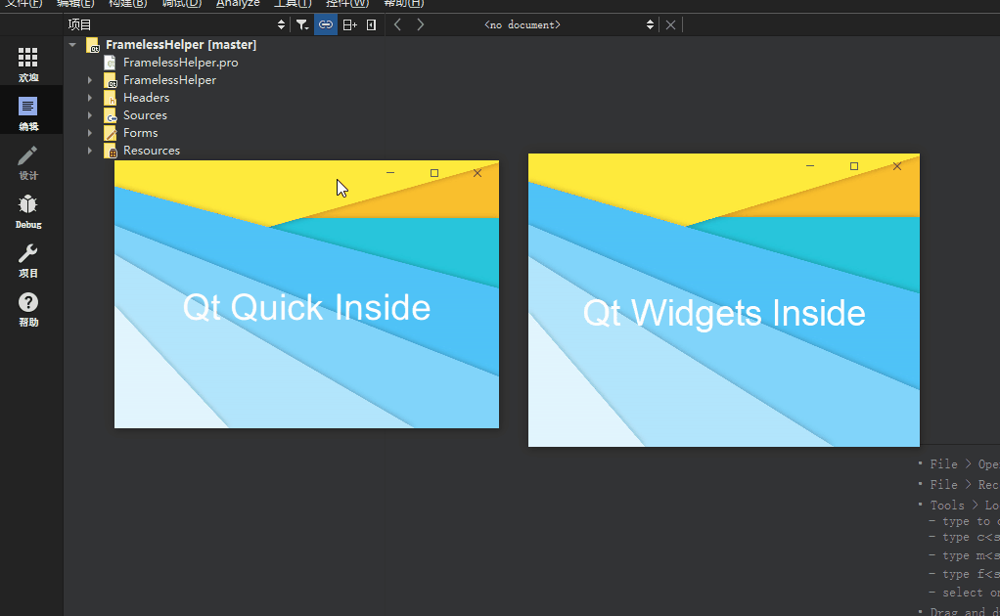
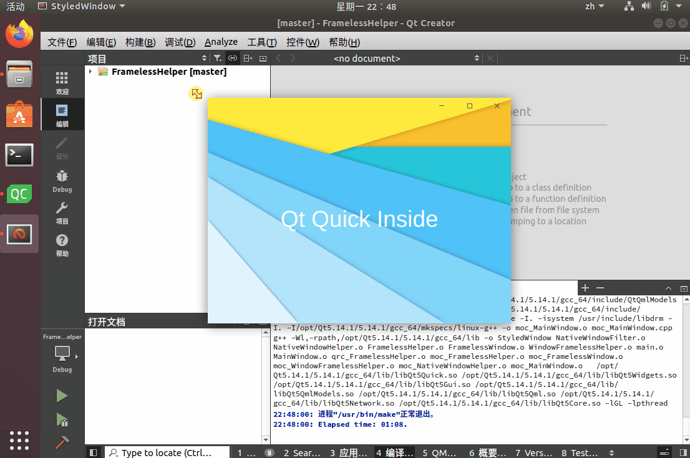
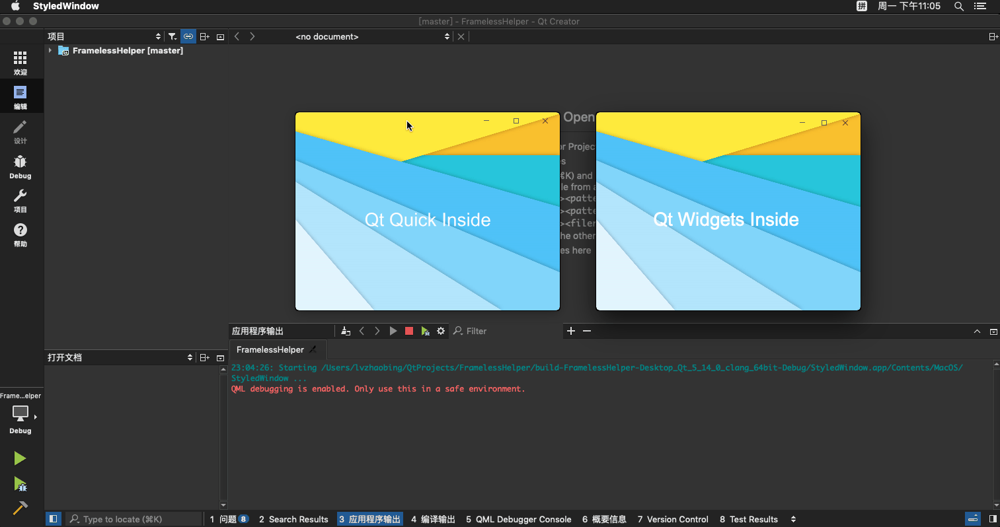

# Qt FramelessHelper
- Supported operating systems
  - Windows
  - Linux (Ubuntu 18.04)
  - MacOS
- Supported features
  - Frameless Window
  - Windows / MacOS: QtQuick Qwidget full features: shadow drag resize
  - Linux: QtQuick drag resize
---------
- 支持的操作系统:
  - Windows
  - Linux （只在Ubuntu18.04开发环境中测试）
  - MacOS
- 支持的功能
  - 支持自定义标题栏的无边框窗口
  - 在Windows 或 MacOS 平台支持： QtQuick QWidget两种模式
  - Linux 目前只支持了QtQuick
  - 在以上支持的所有平台/开发模式中 支持以下功能
    - 鼠标拖动标题栏移动窗口
    - 鼠标靠近边框/四个角 调节窗口尺寸
    - 外边框阴影
    - 三个按钮的最大化/最小化/还原
  - 只在 Windows 平台 支持以下原生特性
    - 拖动窗口靠近顶部 最大化
    - 从最大化状态拖动标题栏 还原窗口
    - 拖动到屏幕四个边框或四角 窗口分屏
    - 找回了Windows窗体默认的外边框阴影
- 其他相关介绍
  - 主要参考了两个项目
    - https://github.com/qtdevs/FramelessHelper
    - https://github.com/mengps/QmlControls/tree/master/FramelessWindow
  - 所做的改动:
    - 在比第五代Intel CPU更老的集成显卡环境下 设置 WS_THICKFRAME 会暴露出：QtQuick中 OpenGL渲染错位的BUG，据说是显卡驱动引起的 可以能修改配置项使用OpenGL ES 绕过这个问题 解决办法参考：[解决办法](https://bugreports.qt.io/browse/QTBUG-40485?focusedCommentId=376505&page=com.atlassian.jira.plugin.system.issuetabpanels%3Acomment-tabpanel#comment-376505)
    - 整合了上述两个项目中的核心代码并在各自操作系统下条件编译
- 运行效果

